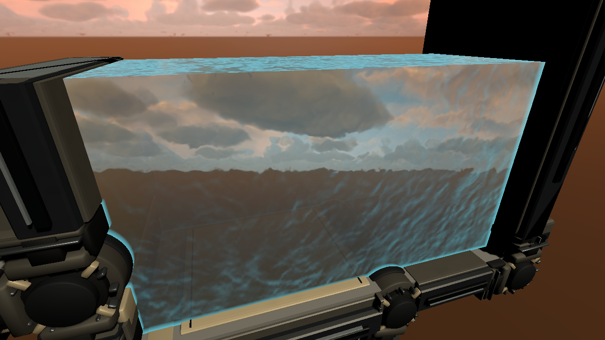
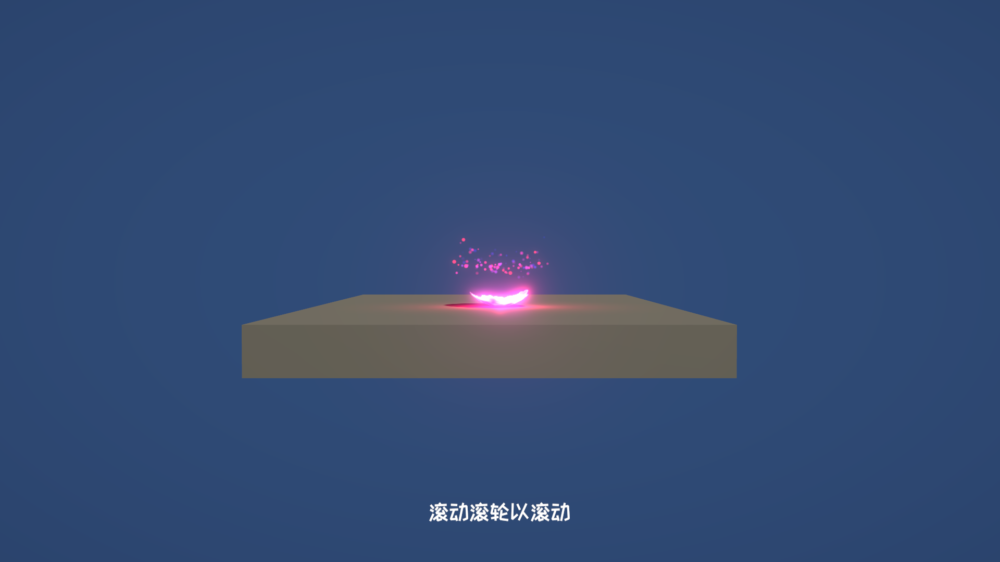
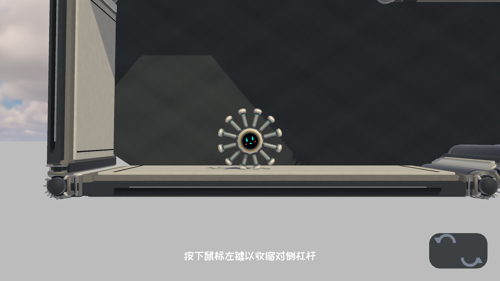

# Unity URP Shader 作品集

这里展示我在《SpikeBall》中制作的三项实时渲染效果：立方体水体、角色生成消散和角色描边。每项效果都有工程实机截图及对应的 Shader 源码。

## 立方体水体

水体使用双层动态法线、Fresnel 边缘响应、场景颜色折射和场景深度着色。交界泡沫由水体与场景的深度差控制；`WaterURPVisualController.cs` 使用 `MaterialPropertyBlock` 控制立方体不同表面的折射。

源码：[StylizedWaterVolumeURP.shader](Assets/Shaders/Water/StylizedWaterVolumeURP.shader) · [WaterURPVisualController.cs](Assets/Scripts/Water/WaterURPVisualController.cs)

水体材质需要法线纹理、Fresnel 查找纹理和颜色渐变纹理。完整折射效果需要在 URP 中启用 Opaque Texture 和 Depth Texture。控制脚本通过名为 `Up` 和 `Front` 的子物体渲染器设置对应表面的参数。

## 角色生成消散

角色进入关卡时，程序化噪声与高度方向的消散进度形成发光边界。效果还使用 Fresnel 着色、边界附近的顶点位移和配套粒子。

源码：[PlayerSpawnDissolve.shader](Assets/Shaders/Dissolve/PlayerSpawnDissolve.shader) · [PlayerSpawnParticles.shader](Assets/Shaders/Dissolve/PlayerSpawnParticles.shader) · [GlobalPlayerSpawnEffect.cs](Assets/Scripts/Dissolve/GlobalPlayerSpawnEffect.cs) · [PlayerSpawnEffectSettings.cs](Assets/Scripts/Dissolve/PlayerSpawnEffectSettings.cs)

## 角色描边

`CharacterOutlineComposite.shader` 采样角色遮罩和场景颜色，在屏幕空间计算轮廓，并保留角色边缘附近的色彩。截图展示了该效果在关卡中的实际画面。

展示源码：[CharacterOutlineComposite.shader](Assets/Shaders/Outline/CharacterOutlineComposite.shader)

该 Shader 在原工程中接收 `_CharacterOutlineMask` 和 URP 的 `_BlitTexture`。接入其他工程时，需要由渲染流程生成角色遮罩，并提供描边宽度、强度等参数。

## 环境与使用

原工程使用 Unity `2022.3.53f1c1`、Universal Render Pipeline `14.0.11`、HLSL / ShaderLab 和 C#。本仓库用于阅读效果实现；运行时所需的模型、贴图、场景和渲染配置由使用者在自己的 Unity 工程中准备。

© 2026 林卓娜。源码与截图用于作品集展示；转载和商业使用请先联系作者。
